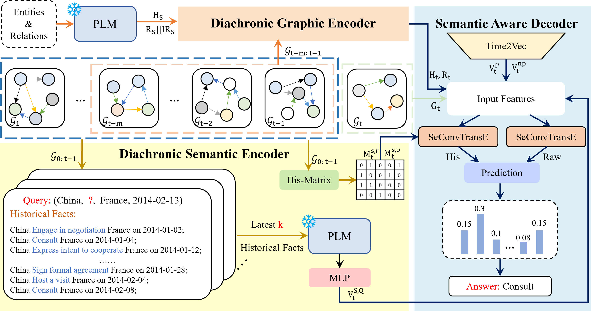

# Diachronic Semantic Encoding Based on Pre-trained Language Model for Temporal Knowledge Graph Reasoning

<div style="text-align: center;">
    
    <p>DSEP model architecture.</p>
</div>

This repository contains the code for DSEP (Diachronic Semantic Encoding Based on Pre-trained Language Model for Temporal Knowledge Graph Reasoning), a model designed to use pre-trained language models (PLMs) for temporal knowledge graph reasoning. DSEP can be used to handle entity and relation prediction tasks in temporal knowledge graphs.


## Installation
To set up the environment for DSEP, follow these steps:

Create and activate a new Conda environment named 'dsep' with Python 3.11
```bash
conda create -n dsep python=3.11
```

<!-- conda remove --name dsep --all -->
```bash
conda activate dsep
```

Install required packages from the provided requirements file.
cd to DSEP directory
```bash
pip install -r requirements.txt
```

`torch`, `torchvision` and `dgl` require specific matching `CUDA Version` installed on your system to ensure compatibility.

## Example

Here is an example of how to install "torch", "torchvision" and "dgl" compatible with `CUDA 12.1` under `Linux`. 

Install torch and torchvision for CUDA 12.1.
```bash
conda install pytorch==2.1.2 torchvision==0.16.2 torchaudio==2.1.2 pytorch-cuda=12.1 -c pytorch -c nvidia
```

Install dgl for CUDA 12.1.
```bash
conda install -c dglteam/label/th21_cu121 dgl
```

### Note:
- You can check your installed CUDA version by running:
  ```bash
  nvidia-smi
  ```

- You can find detailed installation instructions and download links on the following official sites:

  - [PyTorch Official Website](https://pytorch.org/)
  - [DGL Official Website](https://www.dgl.ai/pages/start.html)


## How to Run

```bash
unzip data
```

### Prepare PLM
The following is an example of the file content format that needs to be configured in the `plm` folder to use PLM:

```plaintext
plm/
├── bert/
│   ├── bert-large-cased/
│   │   ├── config.json
│   │   ├── flax_model.msgpack
│   │   ├── pytorch_model.bin
│   │   ├── tokenizer_config.json
│   │   ├── tokenizer.json
│   │   ├── vocab.txt
│   └── bert-base-cased/
│       ├── config.json
│       ├── pytorch_model.bin
│       ├── vocab.txt
```


- **`plm/`**: The root directory for pre-trained language models.
- **`bert/`**: A directory for all BERT models.
  - **`bert-large-cased/`**: Contains the files for the `bert-large-cased` model.
  - **`bert-base-cased/`**: Contains the files for the `bert-base-cased` model.


Here are the links to download the PLMs used from huggingface:

- **BERT Large Cased**: [https://huggingface.co/bert-large-cased](https://huggingface.co/bert-large-cased)
- **BERT Base Cased**: [https://huggingface.co/bert-base-cased](https://huggingface.co/bert-base-cased)


### Train Models

To train the DSEP models, you can use the following command, `{}` indicates optional parameters:

```bash
cd src
```

```bash
python main.py -d ICEWS14 --model-type bert --plm bert-large-cased --gpu 0 --add-static-graph --num-k 7 --history-len 11 --self-loop --layer-norm {--write-output} {--save}
```

### Evaluate Models

To evaluate the DSEP models, add the `--test` argument to the training command. 


### Detailed Hyperparameters

The following commands and trained models can be used to replicate the entity and relation prediction results reported in the paper. Remove `--test` to train new models.

#### ICEWS14

```bash
python main.py -d ICEWS14 --model-type bert --plm bert-large-cased --gpu 0 --add-static-graph --num-k 7 --history-len 11 --self-loop --layer-norm --test {--write-output} {--save}
```


#### ICEWS18

```bash
python main.py -d ICEWS18 --model-type bert --plm bert-large-cased --gpu 0 --add-static-graph --num-k 5 --history-len 14 --self-loop --layer-norm --test {--write-output} {--save}
```

#### ICEWS05-15

```bash
python main.py -d ICEWS05-15 --model-type bert --plm bert-large-cased --gpu 0 --add-static-graph --num-k 5 --history-len 14 --self-loop --layer-norm --test {--write-output} {--save}
```

#### GDELT

```bash
python main.py -d GDELT --model-type bert --plm bert-large-cased --gpu 0 --num-k 7 --history-len 12 --self-loop --layer-norm --test {--write-output} {--save}
```

## Acknowledge

Some of our code is referenced from RE-GCN: [https://github.com/Lee-zix/RE-GCN](https://github.com/Lee-zix/RE-GCN) and TiRGN:[https://github.com/Liyyy2122/TiRGN](https://github.com/Liyyy2122/TiRGN).
